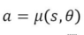
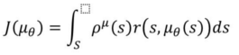
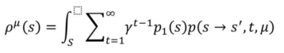
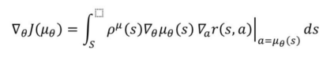
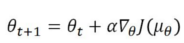
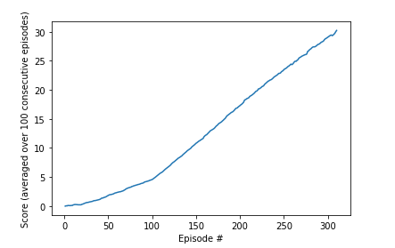

# 1. Introduction
This document describes the training of a robot arm with two joints that shall be able to track the motion of a moving target. For each time step the robot touches the target it receives a reward of +0.1.
To control the robot 4 continuous actions are computed which correspond to the joint torques of the robot and which are scaled between +/-1 for joint max and min torque respectively. The state space consists of a total of 33 states (translational and angular position and velocity of the robot joints, etc).

The training task is considered solved when the robot is able to achieve an average score of +30 for 100 consecutive episodes. The project contains the following files with the following functions:

- Continuous_Control.ipynb: Jupyter Notebook to load the required python modules, perform the training process and display the results
- ddpg_agent.py: contains the classes Agent and ReplayBuffer. In the ReplayBuffer (state, action, reward, next_state)-tuples are recorded during robot operation and are stored to be used in the training process.
  The Agent class defines (among others) the functions to select the next action for the robot and to train the robot by applying the DDPG algorithm. This is explained in greater detail in the next section of this document.
- model.py: here the architecture of the actor and critic neural network(s) that are used for the DDPG algorithm are defined.
- checkpoint_actor/critic.pth: Snapshots of the trained networks for actor and critic. For inference only the actor network will be required.

# 2. Learning Algorithm
In this section the Learning Algorithm that is defined in ddpg_agent.py is described in greater detail. DDPG here stands for "Deep Deterministic Policy Gradient". The deterministic states that an action is chosen deterministically for a given state input vector (unlike many other policy gradient algorithms where the action is sampled from a probability distribution). This means:

where a stands for the chosen action, s stands for the state input and theta denotes the coefficients of the function approximator that is used to encode a policy mu which defines the mapping between state input and action output. In the case of this project a neural network will be used for function approximation.
The goal of the algorithm now is to find a policy that optimally controls the robot by directly maximizing the expected reward J of the robot actions. For the deterministic case the expected reward can be formulated as follows [1]:

As can be seen from the equation above the expected reward is a sum (over all possible states) of the (discounted) rewards r starting from state s onward. The factor rho(mu) accounts for the fact that when selecting a certain action the next state is reached only with a certain probability (stochasticity of the Markov Decision Process model). rho(mu) therefore represents the state distribution when following a certain policy [1]:

gamma in the equation is a discount factor that weighs the next time steps more than time steps that lie further in the future.
The expected reward can then be maximized by computing the gradient of J with respect to the coefficients of the function approximator and by then adjusting the weights in the positive direction of the gradient [1]:

alpha in equation 5 stands for the learning rate with which the function approximator coefficients are updated.
For the DDPG algorithm the computation of the reward from eq. 4 will be performed with a DQN-network which is called the critic in this context. As a DQN-network approach has been used in the first project of this nanodegree as well please find the description of the DQN algorithm in the Report document of my github repository of this project [2]. Finally the integral of eq4 will be replaced with (minibatch) sampling.

As already mentioned for the function approximator a neural network will be used. It is called the actor in this context. In fact similarly to the DQN critic the actor will consist of two networks - a local and a target network. The local network will be used for training and the weights of the local network will be slowly blended to the target network. This is done in order to make the training process more stable.

To make the algorithm explore the state space during the training process, Ornstein-Uhlenbeck noise is added to the output of the actor network when the next robot action is computed.

# 3. Network Architecture
The actor network(s) have 33 inputs (the state vector), two hidden layers with 512 weights in the first and 256 in the second hidden layer and 4 (continuous) outputs. Relu's are used as activation functions for the hidden layers and tanh is used to compute the outputs from the last layer.
The critic network(s) take the state vector as input for the first layer. The first hidden layer has 512 weights and takes the output from the network input layer concatenated with the actions from the input tuple as input. This layer is followed by a second hidden layer with 256 weights and an output layer with 1 output. Relu activations are used throughout the critic network. 

# 4. Training Progress
To train the algorithm a pool of training samples is built that consists of (state, action, reward, next_state, done)-tuples that are recorded during the training process. To avoid correlations between training samples, batches are sampled randomly from this training pool and are provided to the network.
The following hyperparameters are chosen for the training process:

- The replay buffer has a size of 1e6
- One training batch consists of 512 experience tuples
- The discount factor for computing the DQN-expected reward is 0.99
- The parameters of the target network are updated every 4 episodes; the update is performed as a "soft update" where the old network parameters are weighted with 1e-3 and the new parameters are weighted with 0.999.
- The learning rate for actor and critic is set to 1e-4

The training progress can be seen in the following figure:

Ultimately it took 310 episodes to train the network.

# 5. Ideas for Future Work
To enhance the training process it could be interesting to simulate several instances of the robot simultaneously and to use the D4PG algorithm instead.

# 6. References
[1]: Silver D., Lever G., Heess N., Degris T., Wierstra D., Riedmiller M.: Deterministic Policy Gradient Algorithms; Proceedings of the 31st International Conference on Machine Learning, Beijing, China, 2014

[2]: https://github.com/markusbrn/DrlNDNavigationP1
